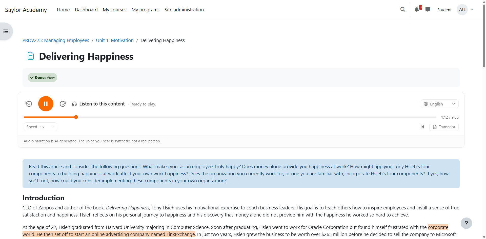
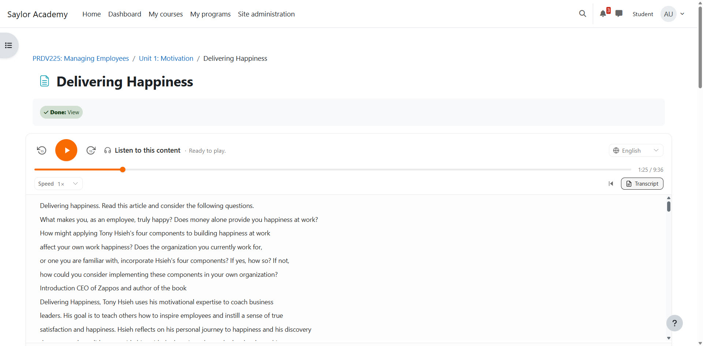

# AI Reader for Moodle

Adds a **"Listen to this content"** audio player to the top of supported
Moodle resources. Learners hit play; the page reads itself.

Audio is generated once by AI, cached on your Moodle site, and reused for
every student who visits the same activity afterwards. There's no
per-student cost and no waiting on the API at page-load time.

## Screenshots

### Player with karaoke highlighting

The player sits at the top of the activity. As audio plays, the
currently-narrated sentence lights up inside the original page text —
no duplicated transcript, no layout shift.

### Transcript pane open

Learners can also expand a click-to-seek transcript pane below the
player. Used automatically when in-place matching falls below 50% —
typically on translated narrations or pages with embedded video.

## What learners get

- A clean podcast-style player at the top of every Page and Book chapter.
- Play, pause, scrub, skip ±15 seconds, change speed (0.75× to 2×).
- Lock-screen and Bluetooth-headphone controls on mobile.
- "Resume where I left off" the next time they open the same lesson.
- Optional **karaoke-style highlighting** that lights up the words on the
  page as the audio reads them, with a click-to-seek transcript.
- Optional **language picker** — the page is translated and re-narrated in
  whichever languages you've enabled (a checklist of every language the
  OpenAI speech models support).
- Optional **voice picker** — enable two or more OpenAI voices and learners
  choose who reads to them; each voice's audio is generated once and cached
  like everything else.

## What instructors get

- Narration is on by default for every Page and Book chapter — no
  per-activity setup.
- A "Turn off for this page" toggle right on the player for anything that
  shouldn't be read aloud (e.g. mostly-video pages).
- Per-chapter on/off control inside Books.
- A regenerate button when content changes.
- Hidden chapters stay hidden — students can't sneak audio for chapters
  they're not allowed to see.
- **Eight player looks** to match the course design: the full player, a
  one-row slim bar, pill triggers that expand on click, a banner, an
  accordion, and a pill + bottom-docked mini-player whose controls follow
  the learner down long pages.
- A redesigned settings page: six sections with a filter, per-setting
  defaults with one-click reset, and advanced options tucked away.

## What it's good for

- **Accessibility.** Students with low vision, dyslexia, or reading
  difficulties get audio for every page, not just specially-prepared ones.
- **On-the-go learners.** Lessons become listenable on a commute or a walk.
- **ESL students.** Combined with the language picker, every page can be
  available in a learner's native language as both translated text and
  spoken audio.

## Compatibility

The plugin is CI-tested on every push against:

| Moodle | PHP | Database |
|---|---|---|
| 4.5 LTS, 5.0, 5.1, 5.2 | 8.1, 8.2, 8.3, 8.4 | PostgreSQL 15+ or MariaDB 10.11+ |

You'll also need:

- **An OpenAI account and API key** — see *Getting an OpenAI API key* below.
- **Moodle cron running** — audio is generated in the background, not
  while a learner is staring at the page.
- **Outbound HTTPS** from the Moodle server to your API endpoint.

## Getting an OpenAI API key

This plugin uses OpenAI for three things: text-to-speech, translation
(optional), and Whisper alignment for the karaoke highlighting (optional).
All three are paid API services, billed to your OpenAI account by usage —
**there is no free tier the plugin can rely on**.

To set up an account:

1. Create an account at **https://platform.openai.com/signup**.
2. Add a payment method under **Billing**, then add a credit balance.
   $10 is plenty to evaluate the plugin against a few dozen pages; see
   the cost table below for realistic per-asset numbers.
3. Open **Dashboard → API keys**, click **Create new secret key**, and
   copy the `sk-…` value somewhere safe — OpenAI only shows it once.
4. Paste it into *Site administration → Plugins → Local plugins →
   AI Reader → OpenAI API key*.

The same key is reused for TTS, translation, and Whisper unless you
override the endpoint settings to point at a proxy.

The plugin works with any OpenAI-API-compatible gateway as well (Azure
OpenAI Service, LiteLLM, OpenRouter, vLLM, etc.) — just change the three
endpoint settings to point at your gateway. Outbound calls are locked to
HTTPS; loopback, private, and link-local addresses are blocked.

## Install

1. Install the plugin like any other Moodle local plugin:
   - Drop this directory at `<moodle>/local/aireader/`, **or**
   - Upload the ZIP at *Site administration → Plugins → Install plugins*.

2. Visit *Site administration → Notifications* and complete the upgrade.

3. Open *Site administration → Plugins → Local plugins → AI Reader* and
   fill in:

   - **OpenAI API key** — your `sk-…` key.
   - **Default voice** and **TTS model** (defaults work for most sites).
   - *(Optional)* **Voices offered to learners** — tick extra voices to give
     learners a voice picker on the player.
   - *(Optional)* **Languages offered to learners** — tick the languages to
     offer; leave only English ticked to hide the language picker.
   - *(Optional)* **Enable Whisper alignment** — turns on the karaoke
     highlighting.

4. Open any Page or Book chapter. The first viewer triggers background
   generation; the audio appears within seconds to a couple of minutes
   depending on length.

That's it. Every learner who opens the same activity afterwards streams
the cached file — no extra API cost.

## What does this cost to run?

Roughly:

- **~$0.06** per 1000 words of narrated text (OpenAI TTS), one-time per
  page or chapter.
- **~$0.0003** per 1000 words for each translated language, one-time.
- **~$0.006** per minute of audio if you enable karaoke highlighting.
- Each extra **voice** a learner actually requests is another one-time TTS
  generation for that page — the enabled-voices checklist is your budget
  lever.

Multiply by however many of your pages and books learners actually open.
Everything is cached on your Moodle site after first render, so a class
of 200 students reading the same chapter costs the same as one.

A built-in **per-asset cap** (default 50,000 characters ≈ 50 minutes of
audio, ~$3) prevents any single page from going wild.

## Privacy

The plugin sends **cleaned activity text** to the configured OpenAI
endpoint for narration and (optionally) translation. **No user
identifiers — names, emails, IDs — are sent.**

It stores these pieces of per-user data on your Moodle site:

- **Resume positions.** Where each learner last paused.
- **Listened ranges.** The distinct audio ranges each learner played in the
  embedded player when listening-based completion is enabled.
- **Configuration authorship.** Which manager or teacher last toggled
  narration or listening-based completion settings for a given page or chapter.

All are covered by the standard Moodle Privacy API — export, delete-by-user,
and delete-by-context all work out of the box.

## License

GPL v3 or later — see [LICENSE](LICENSE).

## Links

- **Issues & feature requests:** https://github.com/dta121/moodle-local_aireader/issues
- **Release notes:** [CHANGELOG.md](CHANGELOG.md)
- **Source:** https://github.com/dta121/moodle-local_aireader
